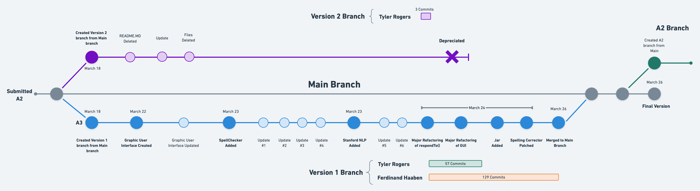
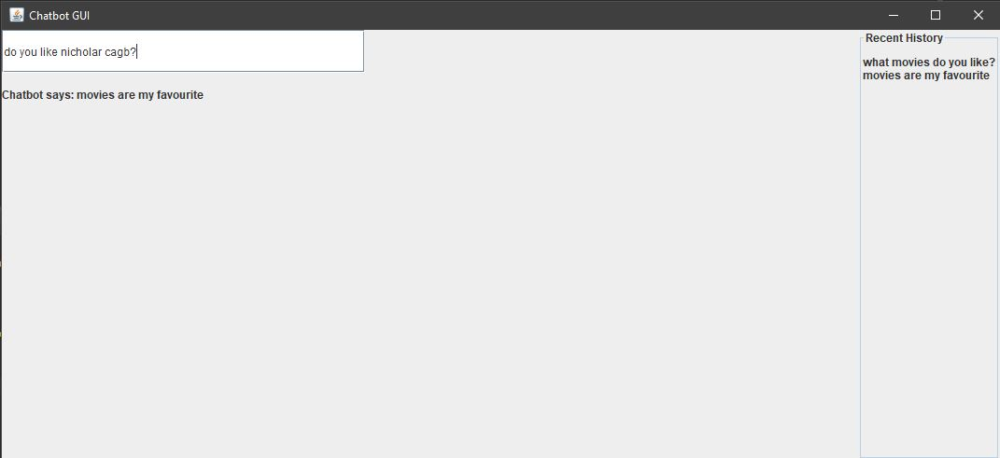
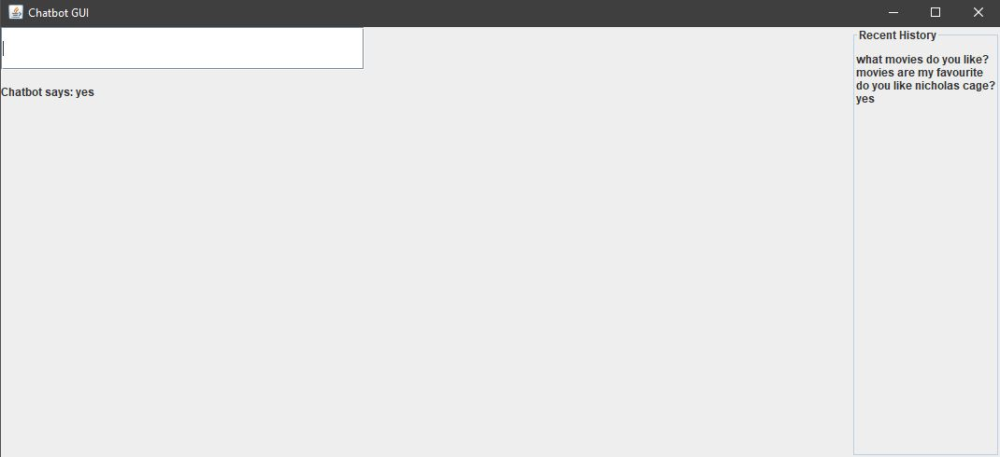
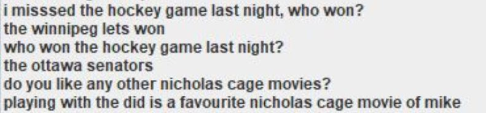

## REPO STRUCTURE



# TEAM-2 A3 CHATBOT

#### Pair Programming and Documentation: Tyler Rogers, Ferdinand Haaben

#### Lead: June Kang

#### Graphics: Kenneth OH


## ROLE AND TOPICS

<p>
This project is a chatbot that plays the role of a friend.
</p>
<p>
The conversation topics are
<ul>
<li>favorite food, hobbies, books, sports.</li>
<li>sports</li>
</ul>
</p>


## RUN INSTRUCTIONS

<p>Run the jar file</p>
<p>Make sure that the Knowledge.dat file is in the same folder as the chatbot.jar file</p> 
<p>The jar file can be found at this <a href="https://drive.google.com/drive/folders/1cm9XKGfR2VE56yod4Qd6UOahiBAvwxvg?usp=sharing"> google drive link.</a></p>


## HOW IT WORKS


<p>There are two java docs in our repo. They are located in the documentation folder.</p>

### Chatbot JAVA DOC
<p>Java Doc contains everything about the Chatbot members.</p>

### JUNIT JAVA DOC
<p>Java Doc summarizes test cases</p>


<ul>
<li>

### General

</li>

The bot is based on a question and answer format. It responds to questions with answers, and responds to answers with questions.

The bot has a knowledge base made of 3 components.
<ul>
<li>An arraylist of questions.</li>
<li>An arraylist of answers.</li>
<li>A hashmap of question-answerlist pairs. Each question in the hashmap has an arraylist of possible answers.</li>
</ul>
<br>
<p>
The knowlage base is stored in the knowledge.dat file.

If the input is "###" the bot will print its knowledge base.

If the input is "stop" the program will stop.
</p>

</ul>

<ul>
<li>

### Input Is An Answer
<ul>
<li>bot adds answer to arraylist of answers bot checks previous response if the previous response was a question.</li>
<li>bot adds answer to hashmap. bot attempts to ask relevant questions.</li>
</ul>
</li>


<li>

### Input Is A Question
<ul>
<li>bot adds a question to arraylist of questions</li>

<li>bot checks hashmap for question if question is in hashmap</li>

<li>respond with one of the mapped answers if question is not in hashmap</li>

<li>add question to hashmap attempt to respond with relevant answer</li>
  
<li>To come up with a relevant answer the bot parses the input string into words and then tries to respond with a string containing those words.</li>

<li>The bot will respond with a string that has the most matching words with the input string.</li>

<li>The bot also keeps track of the last 5 responses and does not reapeat them.</li>
</ul>
</li>
</ul>


## CLASS STRUCTURE AND ORGANIZATION
A Chatbot has Knowledge, a language processor, and a GUI. Knowledge has a HashMap. A GUI has a Spellchecker. A language processor has a Pipeline


## GUI

The GUI is a simple window that has a text box for user input and shows the bot reply along with a history.




## CONVERSATION TOPICS

The bot is capable of talking about anything in its knowledge base. To expand the knowledge base the user simply has to 

start talking to the bot about it.

## CONVERSATION INPUTS OFF TOPIC

<p>This is the feature that was added to handle input outside of the two topics</p>

```JAVA
if (topMatchingWords == 0) {
	response = getRandomResponse(getResponse(!isQuestion));
```


A future release of the bot would focus on improving performanc.

## SPELL CHECKING

<p>
Compares the word with known words, and tests
 their similarities. If they are similar, replace the word with know word,
 
otherwise, then learn the new word. The bot uses Levenshtein Distance Algorithm to test similarity.
</p>

### Levenshtein Distance Algorithm

<p>
<strong>This code is not ours, we do not take credit for it, we are just
using it.</strong> It was taken from,

jdk.internal.org.jline.utils.Levenshtein
</p>


### Misspelled vs. New "Unknown" word
<p>
The logic is this, the bot only know words about food, hobbies, and sports.
So if the user feeds the bot with a word that it has not encountered before,
it needs to decide if the new word is just spelled wrong, or is a new, valid
word.
</p>

### Sanity Check

```Java
if (matchStrength <= 2 && bestMatchingWordSoFar.length() > 0
    && Math.abs(word.length() - bestMatchingWordSoFar.length()) < 3)
  return bestMatchingWordSoFar;
return word;
```
## SAMPLE OUTPUT

### Spell Checker in Action

Here I enter nicholar cagb.


Here the bot corrects the spelling to nicholas cage you can see the corrected spelling in the column on the right side.



### Language Processing

The stanford NLP libraries were used when finding the number of matching words more accuratley than in the first version of the bot.

The standford libraries are used to simplify sentances into lists of root words that are then compared. 

This is done because the bot can match two words such as "eating" and "ate" by converting them both into "eat".

The stanford libraries are also used to only compare nouns, verbs and adjectives. Because these are most relevant to conversation.

Word matching in action below "running" and "run" are matched.


### Full Conversation


## SHARABLE APIs

<ol>
<li>The way our bot "learns" new responses by saving the user input</li>
<li>The way our bot finds the appropriate response by first checking the hashmap and then finding a response within its knowledge base by matching words</li>
<li>The knowledge object and associated file</li>
<li>The spell checker</li>
<li>The word matching technique using Stanford NLP</li>

</ol>


## PROBLEMS

### Performance

<p>high ram usage ~3GBs.</p>
<p>entering paragraph crashes the program.</p>
<p>slow performance. high cpu usage.</p>
<p>The use of the stanfordnlp libraries significantly reduced the performance of the bot.</p>
<p>there is a triple nested loop in the compare method. compare has one for loop, and in that loop, it calls a method that has a nested loop. there is an O(N^3) performance in this method.</p>

### Spell Checker

In the image below, the spell checker corrects unknown words to known words and thereby responds incorrectly.

It corrects "winnipeg jets" to "winipeg lets".

In the same dialog the bot does not know how to respond to "The ottowa senators" and picks a random response out of its knowledge base.

Both of these issues could be fixed if the bot was trained with a very high volume of correctly spelled sentences. The high volume is

important, because it increases the probability that the bot will have something relevant to say. 

We did not have time to chat with our bot for hours at a time. Perhaps this process could be automated in the future.



## FUTURE

<p>Improve performance by refactoring the compare method, or parallelizing it. there are no loop carried dependencies, so this is embarasingly parallel.<p/>

Automate the building of the knowledge base so that it can be as large as possible

