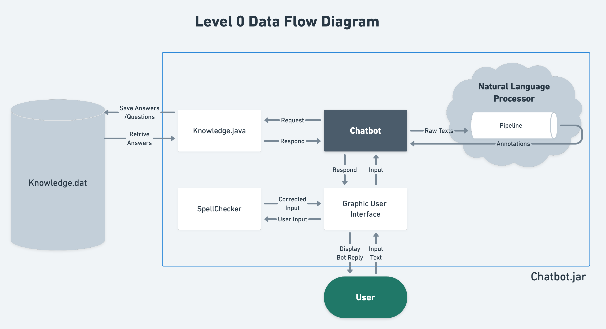
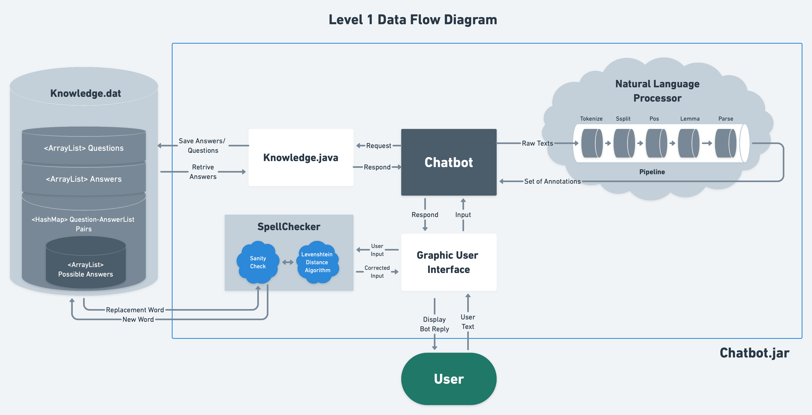
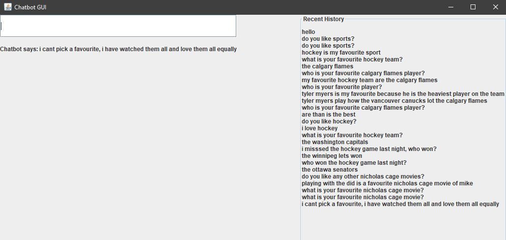
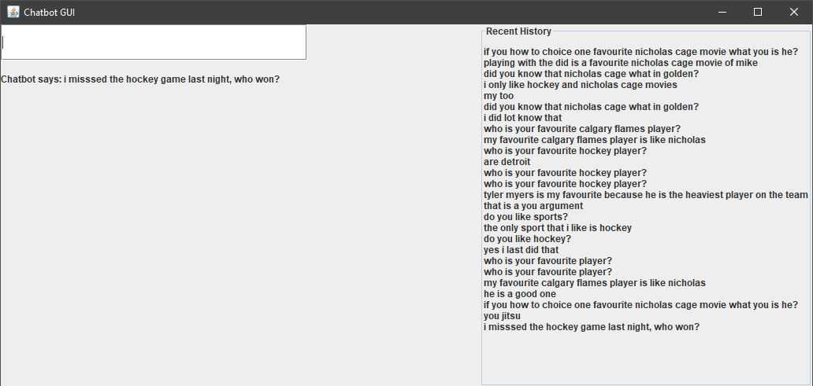

# COSC 310 Individual Project
## Author: Kenneth Oh

## ROLE AND TOPICS

This project is a chatbot that plays the role of a friend.

The conversation topics are
<ul>
<li>favorite food, hobbies, books, sports.</li>
<li>sports</li>
</ul>

## HOW IT WORKS

There are two java docs in our repo. They are located in the documentation folder.

### Chatbot JAVA DOC

Java Doc contains everything about the Chatbot members.

<ul>
<li>

### General

</li>

The bot is based on a question and answer format. It responds to questions with answers, and responds to answers with questions.

The bot has a knowledge base made of 3 components.
<ul>
<li>An arraylist of questions.</li>
<li>An arraylist of answers.</li>
<li>A hashmap of question-answerlist pairs. Each question in the hashmap has an arraylist of possible answers.</li>
</ul>
 

The knowlage base is stored in the knowledge.dat file.

If the input is "###" the bot will print its knowledge base.

If the input is "stop" the program will stop.

</ul>

<ul>
<li>

### Input Is An Answer
<ul>
<li>bot adds answer to arraylist of answers bot checks previous response if the previous response was a question.</li>
<li>bot adds answer to hashmap. bot attempts to ask relevant questions.</li>
</ul>
</li>

<li>

### Input Is A Question
<ul>
<li>bot adds a question to arraylist of questions</li>

<li>bot checks hashmap for question if question is in hashmap</li>

<li>respond with one of the mapped answers if question is not in hashmap</li>

<li>add question to hashmap attempt to respond with relevant answer</li>
  
<li>To come up with a relevant answer the bot parses the input string into words and then tries to respond with a string containing those words.</li>

<li>The bot will respond with a string that has the most matching words with the input string.</li>

<li>The bot also keeps track of the last 5 responses and does not reapeat them.</li>
</ul>
</li>
</ul>

## CLASS STRUCTURE AND ORGANIZATION
A Chatbot has Knowledge, a language processor, and a GUI. Knowledge has a HashMap. A GUI has a Spellchecker. A language processor has a Pipeline

## CONVERSATION TOPICS

The bot is capable of talking about anything in its knowledge base. To expand the knowledge base the user simply has to 

start talking to the bot about it.

### Full Conversation

## SHARABLE APIs

<ol>
<li>The way our bot "learns" new responses by saving the user input</li>
<li>The way our bot finds the appropriate response by first checking the hashmap and then finding a response within its knowledge base by matching words</li>
<li>The knowledge object and associated file</li>
<li>The spell checker</li>
<li>The word matching technique using Stanford NLP</li>

</ol>

